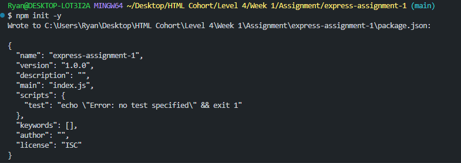
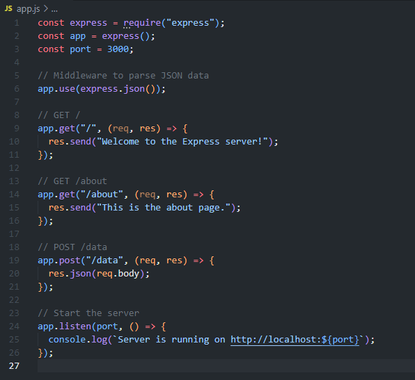
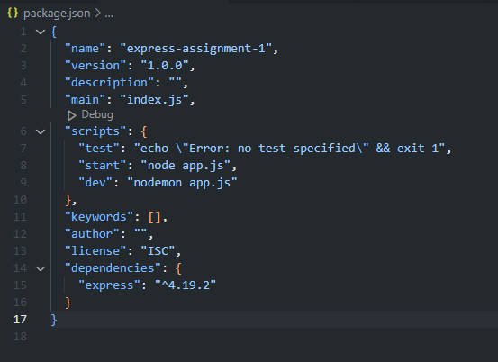
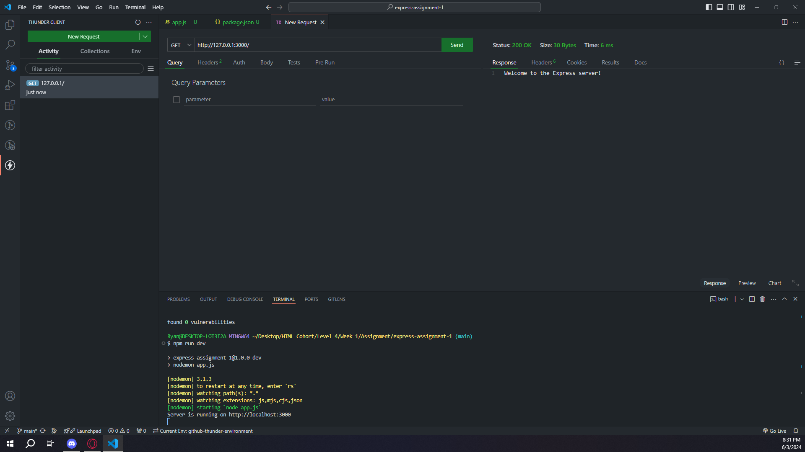
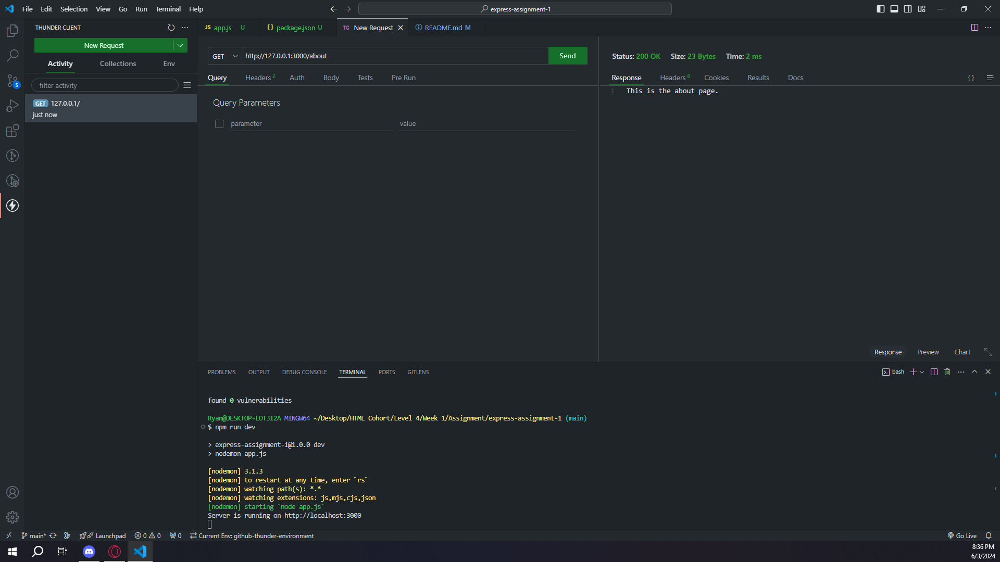
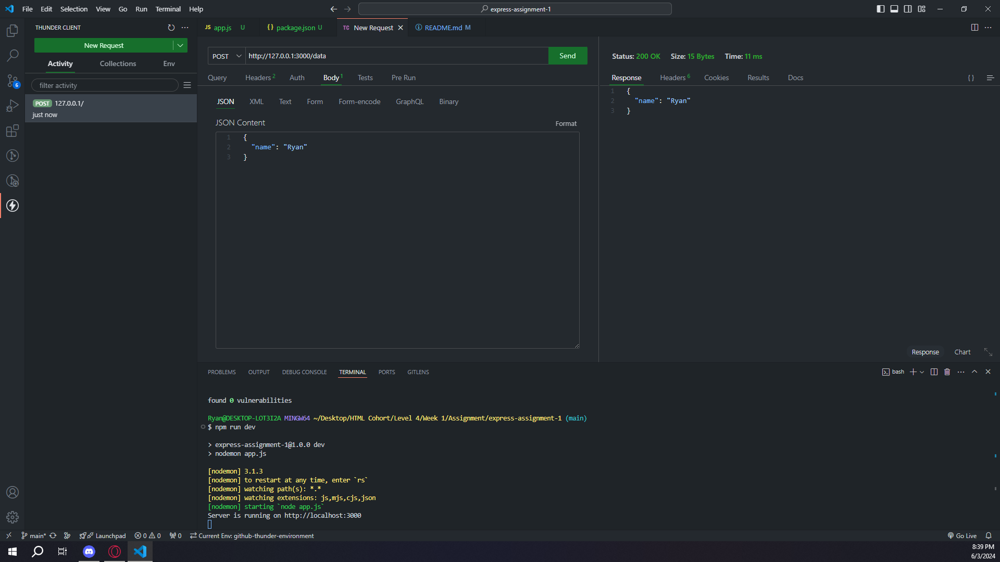

# Objective
Gain hands-on experience with Express by setting up a simple server with specified routes.

# Instructions
## Part 1: Create and Clone Your GitHub Repository
### Create a New GitHub Repository:

Name your repository express-assignment-1.

Initialize it with a .gitignore for Node.js and a README.md.

### Clone Your Repository:

Clone your repository to your local machine.

Navigate to the cloned repository's directory to begin your project setup.

## Part 2: Setup and Configuration
### Initialize a Node.js Project:

Within your project directory, run npm init -y to generate a package.json file.

### Install Express:

Add Express as a dependency with npm install express.

## Part 3: Implement the Server
### Create an Express Server:

Implement an Express server with the following routes:
GET / that returns "Welcome to the Express server!"
GET /about that returns "This is the about page."
POST /data that accepts JSON data and returns it back.

## Part 4: Use Nodemon for Development

### Install Nodemon:

Add Nodemon as a development dependency with npm install --save-dev nodemon.
Installed Nodemon globally using: npm i -g nodemon

### Update package.json:

Update the scripts section to include a dev script:

"scripts": {
  "start": "node index.js",
  "dev": "nodemon index.js"
}

## Part 5: Test the Routes
### Use Thunder Client or Postman:

Test the following routes:

GET / should return "Welcome to the Express server!"
 - Express Page GET

GET /about should return "This is the about page."
 - About Page GET

POST /data should accept and return JSON data.
 - Data POST

# Submission
## GitHub Repository: 

Submit the URL of your GitHub repository. Make sure it includes all necessary files to run the server, the updated README.md, and is set to public.
https://github.com/rja87sd/express-assignment-1